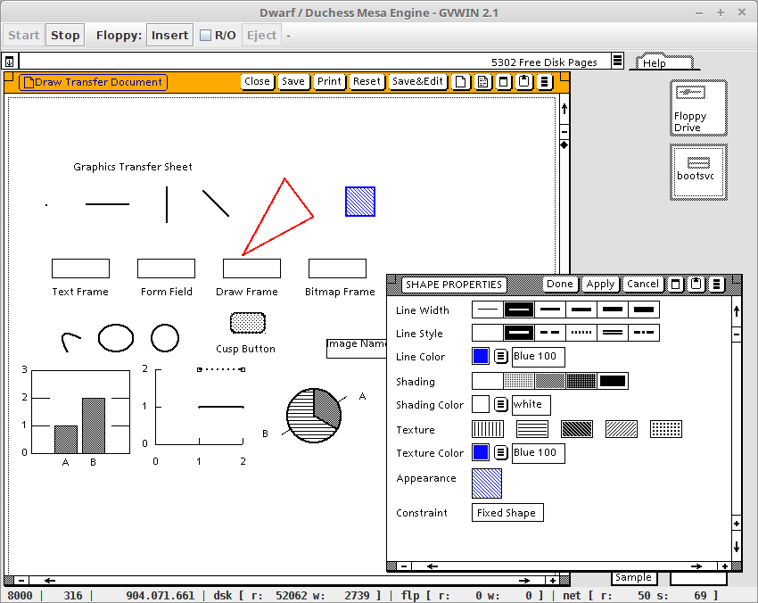
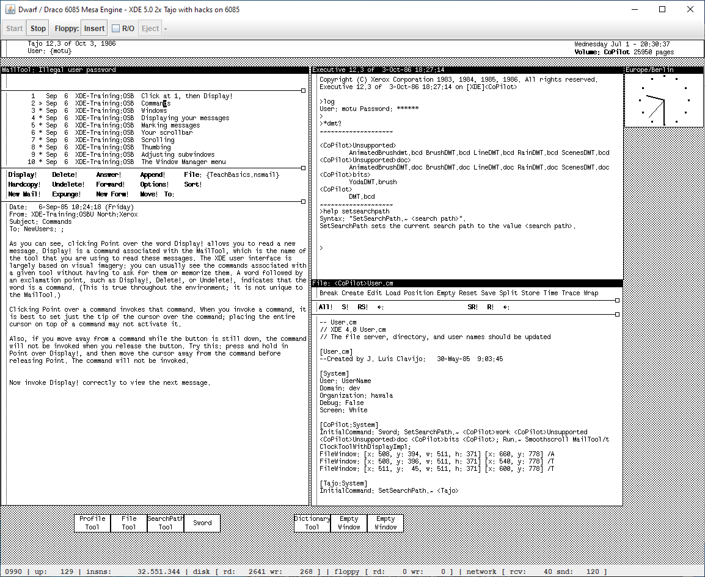
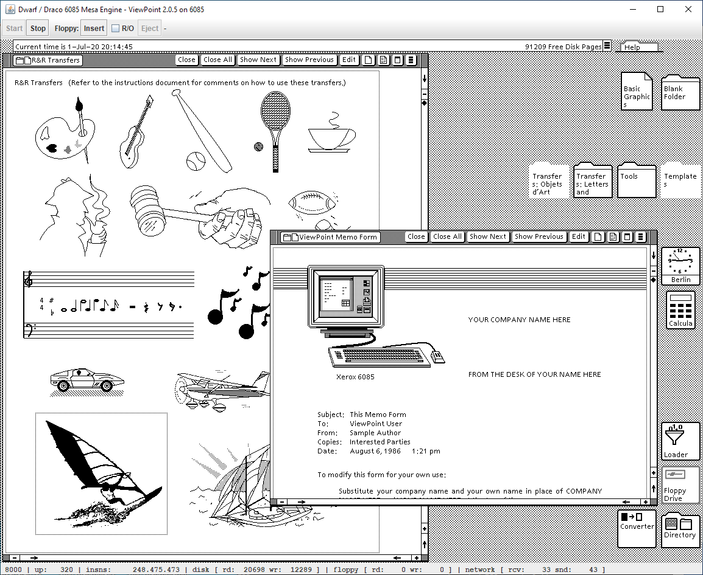

## Dwarf, a Mesa machine architecture emulator for Xerox 6085 and Guam workstations

_Dwarf_ is an emulator for the Xerox Mesa processor architecture with 2 incarnations for
emulating different machine generations marketed by Xerox in the 1980-ies and 1990-ies:
- _Draco_ simulates a 6085 workstation (also called Dove or Daybreak) running the Mesa microcode
- _Duchess_ rebuilds the Mesa machine in the GVWin product, which was itself a software
   emulator running on a PC under MS Windows 3.x

Dwarf is implemented in Java 8 and should therefore run on most systems where the Java 8
and a decent window system is available.

In the tradition of Xerox processor implementations having *D* as first letter (Dolphin, Dorado,
Dicentra, Dandelion, Daybreak, Dove, Daisy, ...), the Java software implementations of the
Xerox machines have been named *D*warf, *D*raco and *D*uchess. 

And yes, it is not the first open source software emulator for the Mesa architecture, this
merit goes (to my knowledge) to Don Woodward for his [Dawn emulator](http://www.woodward.org/mps/)
and Yasuhiro Hasegawa for his [Guam mesa-emulator](https://github.com/yokwe/mesa-emulator/tree/master/guam).  

### Quick start

To run Dwarf, you will first need a Java 8 (or newer) runtime installed for your operating system. Dwarf
was developed on Linux and tested with Linux-Mint, MS-Windows 7 and 10.

Next you will need the Dwarf software. It is available as ready to run release on Github:
download the newest `dist.zip` package from the github repository, unzip the package,
done (more or less).

The archive `dist.zip` contains the directory `dwarf` having the runnable jar `dwarf.jar`
and the default keyboard mapping file, as well as a set of sample configuration and shell script files
for running some 6085 machine setups with Draco (ViewPoint 2.0 and XDE 5.0) and running XDE (Dawn)
and GlobalView (GVWin) environments with Duchess.

And finally you will need the disk images having the Xerox environment to run.

For the Draco 6085 emulation, disk image files for ViewPoint 2.0 and XDE 5.0 are provided in
the Github project in directory `disks-6085`. The [6085 disks readme](./disks-6085/readme.md)
in this directory describes the environment installed on each disk and how to setup the
environment with the sample configurations. 

For the Duchess emulation you will need a bootable virtual disk having a Pilot 15.3 based
Xerox operation system installed and a compatible germ file. This can be the XDE disk provided
by Don Woodward on his site for his Dawn emulator or a GlobalView 2.1 disk:

- for XDE see the Don Woodwards [Dawn emulator](http://www.woodward.org/mps/) page: the page provides
links to the compressed `Dawn.dsk` file and to the source package for Dawn, where the `Dawn.germ`
can be found in the directory `Source/Dawn/Resource`.

- for Globalview (the successor to ViewPoint as successor to Star), you can use the disk image file
of your GlobalView 2.1 installation (usually `C:\GVWIN001.DSK`) along with the germ file
(usually `C:\GVWIN\GVWIN.GRM`).    
If no GlobalView disk is available, ready to run MS Windows 3.1 environments with GlobalView can be found
at the [archive.org](https://archive.org/), e.g. [gvwin.zip](https://archive.org/details/gvwin) or
[win3_globalview_21.zip](https://archive.org/details/win3_globalview_21).


To set up such a Duchess system, copy the disk image file and the germ file into the corresponding
directory of the sample environment and verify that the names match the expected ones in the
configuration files (for XDE: `Dawn.dsk` resp. `Dawn.germ`, for GlobalView:  `GVWIN001.DSK`
resp. `GVWIN.GRM`)

Enough theory, here are screenshots of the emulator running some of the Xerox environments
mentioned above.

Duchess running GlobalView 2.1 in color mode (sample script `duchess-gvwin-color[.sh]`):



Draco running the XDE 5.0 with hacks disk (sample script `draco-xde5.0+hacks[.sh]`):



Draco running the ViewPoint 2.0 disk (sample script `draco-vp2.0.5[.sh]`):



### Working characteristics of Dwarf

Besides a mesa processor, Dwarf supports the following peripherals found on a Xerox workstation:

- real memory
  - Draco: fixed to 2048 kwords (4 MiB)
  - Duchess: configurable in exponential increments between 256 kwords (512 KiB) and 8192 kwords (16 MiB)

- virtual memory
  - Draco: fixed to 16 Mwords (32 MiB)
  - Duchess: configurable in exponential increments from real memory size up to 32768 kwords (64 MiB)

- bitmapped display rendered in a Java Swing window
  - Draco: small (832x633) or large (1152x861) 6085 black&white screen
  - Duchess: black&white or (8-bit) color display in configurable size or as fullscreen display, 

- keyboard (with configurable mapping for Xerox specials keys)

- 2 or 3 button mouse

- one harddisk image    
  (specific file formats for Draco and Guam, as 6085 and Guam disks have different internal structures)

- one floppy drive, image file changeable at runtime
  - Draco: IMD/DMK floppy image format of 6085 (5.25") floppies (read/only)
  - Duchess: 1.44 MByte raw (read/write) or legacy IMD/DMK floppy images (read/only)

- network device, interfacing to a Dodo NetHub or as fallback to an internal time service

Dwarf supports the following floppy image formats:
- IMD for floppies if the file extension is `.imd` (case-insensitive)
- DMK for floppies if the file extension is `.dmk` (case-insensitive)
- raw format for 3.5" floppies as created by the original emulator on PCs

The term "legacy floppy" for Duchess means that the image was created from a floppy disk written by
a 8010 (8" floppy) or a 6085 (5.25" floppy) workstation with a Pilot based OS like XDE (4.0
or later) or ViewPoint (1.0 or later). The disk content of the legacy floppy image is implanted
in a template 3.5" image based on the XDE sector layout. This allows to read the legacy floppy content.
Legacy floppy images are mounted in R/O mode, as changes cannot be written back into the original
format (IMD or DMK).  

When using or thinking of using Dwarf, some characteristics of the implementation should
be kept in mind:

- Dwarf loads the complete virtual hard disk into main memory, performing all disk operations
in memory. When (and if) the system is shut down normally, the modifications to the hard disk
are written to a compressed delta file containing the differences to the original disk, which
stays unmodified. When the same system is next started, Dwarf first reads the original disk
and applies the delta in memory.  
This approach gives fast disk I/O, but possibly requires increasing the Java heap space for
large disks (however a "normal" Pilot disk (under 80 MByte) plus 16 MByte real memory can be used
with Java defaults)

- similarly Dwarf loads a complete virtual floppy disk image file into memory
for diskette operations.    
In case of a raw (1.44 MByte) floppy image mounted in Duchess, when ejecting the floppy
or shutting down the machine, the complete floppy image file is overwritten if the floppy was modified
(no delta file). Legacy IMD or DMK floppies are always mounted read-only and are not written
back, as only reading IMD or DMK files is supported.

- unlike Xerox machines, Dwarf is not a microcoded machine, so Dwarf will only execute the
Mesa instructions; running Lisp or Smalltalk or Cedar environments (would these be available)
by loading a different microcode is not possible.

- Dwarf supports networking by connecting to a Dodo NetHub, allowing to interact with
network elements connected to the same NetHub, these can be other emulated Xerox machines,
a Dodo server providing XNS services or a "real" network with the NetHubGateway (see
[Dodo Services - XNS with Java](https://github.com/devhawala/dodo)).

### Running Dwarf

Besides having the Dawn program installed (mainly a simple runnable Java jar file) with the disk
and germ files, a configuration file defining the characteristics of the machine to run is needed. 

#### Installing or building Dwarf

Dwarf is available as ready to run release on Github (file `dist.zip` in the github repository).
See the above section "Quick start" for the installation of the package.

Hint: the disk or floppy files should not reside in the same directory as the `dwarf.jar` file,
as the Java runtime will high probably enforce the read-only access to files in this directory.

For building from source, download the ZIP or clone the Dwarf Github repository, this gives you
a project directory that can be imported into Eclipse (Neon release or newer).
The main Java class for the _Run Configuration_ is: `dev.hawala.dmachine.DwarfMain`  

#### Defining the configuration of a Dwarf machine

A Draco or Duchess machine is configured with a conventional Java properties file, so the name-value
separator is the `=` character and comments are introduced by a `#`.

Due to the specifics of the emulated hardware peripherals, Draco and Duchess have specific
properties for their respective components, however sharing a set of common properties. The
following sections first describe the common properties and then the specifics for Draco and
Duchess. Looking at the comments in the sample configurations of the distribution package
may also be helpful here.

The following configuration parameters can or must be used for machines emulated with Draco
and Duchess :

- `boot`  
the filename of the boot disk; this must specify a disk file in the correct format for the
emulated system, i.e. a `.zdisk` file with a compressed 6085 disk image for Draco resp.
an (uncompressed) `.dsk` file for Duchess; the emulator will automatically load the current delta file
for that disk type    
_required_

- `switches`  
the boot switches to use  
_optional, default_: `8Wy{|}\346\347\350\377`

- `keyboardMapFile`  
the name of the keyboard mapping file to use; see the syntax description at the
beginning of the sample mapping file [kbd\_linux\_de\_DE.map](keyboard-maps/kbd_linux_de_DE.map)  
_optional, default_: none (if not given, a minimal mapping for a german keyboard is used)

- `xeroxControlKeyCode`  
the key code for the modifier key to be used for generating the special Xerox keys not available
of a contemporary standard keyboard; the value can be given as hex code introduced by `0x` or
as the Java key name (`VK_`...)  
_optional, default_: 0x00000011 (VK_CONTROL)

- `resetKeysOnFocusLost`  
if `true` the keyboard state will be reset to "no keys pressed" when Dwarf loses the input
focus; when `false` the keyboard will not be reset. Resetting all keys to "up" is useful
when changing the current window with Alt-TAB, as the Alt-key is a special key on a Xerox
keyboard.  
_optional, default_: `true`

- `processorId`    
the processor or machine id for the Dwarf machine (or MAC address in todays wording)  
(if networking is used, it should be ensured that **all** machines on the network
have an unique processor id, or Pilot-based machines will stop by entering 0915 state)    
Attention: the processor id is crucial when running ViewPoint, as the "Software options"
available in the ViewPoint installation are bound to this id, so running the same disk
with a modified processor id will invalidate the available software    
_optional, default_: `00-1D-BA-AE-04-C3`

- `title`  
the text to display in the title bar of Dwarfs window  
_optional, default_: value of the property `boot` (the boot disk name)

- `oldDeltasToKeep`  
the number of deltas to keep in addition to the current delta; when saving
a new delta, Dwarf renames the now previous delta using the its save timestamp
and deletes the older backups count exceeding `oldDeltasToKeep`  
_optional, default_: `5`

- `initialFloppy`  
the filename of a virtual floppy file to load in the floppy drive before
starting the engine  
_optional, no default_ (no floppy initially loaded)

- `floppyDirectory`          
the directory-name to use as starting point in the file selection dialog
for the _insert floppy_ function  
_optional, no default_ (platform dependent, probably the home directory)

- `netHubHost`    
the name of the NetHub host to connect to or empty if no NetHub connection
is to be used    
_optional, default_: _empty_ (i.e. no NetHub connection = no networking)

- `netHubPort`    
the port where the NetHub is listening (must be in range 1..65535) or
any invalid port number (e.g. `0`) for no NetHub connection      
_optional, default_: 3333

- `localTimeOffsetMinutes`    
time zone parameter for the internal time service if no NetHub is used:
difference between local time and GMT in minutes, with positive values being
to the east and negative to the west (e.g. Germany is 60 without DST and 120
with DST, whereas Alaska should be -560 without DST resp -480 with DST)    
_optional, default_: 0 (i.e. GMT)

- `autostart`  
the boolean value `true`lets the machine start automatically after
building up the Dwarf UI; by default, the Dwarf machine must be started
manually with the _Start_ button in the toolbar.  
_optional, default_: `false`

- `autoclose`    
the boolean value `true` lets the Dwarf UI automatically close when the Mesa
processor is stopped and after changes made to the disk (and possibly to the floppy)
have been saved.    
_optional, default_: `false`

- `xdeNoBlinkWorkAround`    
work-around for the blinking "Time not set! Create no files!" text in the HeraldWindow
instead of the current date/time.    
(this blinking text is used if the current time is not in a certain time frame starting
with the build-time of the Tajo/CoPilot-bootfile)    
The work-around is to fake the current time to a date in this time frame until the
HeraldWindow has probably checked the time and then get back to the real time; the delay
for the reverting to the real time is given as number of instructions, expressed in 100.000
executed instructions.    
The value is given as `<100thousand-instructions> : <iso-date>`    
_optional, default_: (none)    
the following values usually work:    
`xdeNoBlinkWorkAround = 110 : 1987-06-01` for Tajo 12.3    
`xdeNoBlinkWorkAround = 150 : 1987-06-01` for CoPilot 12.3    
`xdeNoBlinkWorkAround = 150 : 1987-06-01` for Tajo 12.3 + Hacks    
`xdeNoBlinkWorkAround = 81 : 1995-06-01 ` for Tajo 15.3 (Dawn)

The following configuration parameters are specific for Draco (6085) machines:

- `fallbackGerm`    
germ file to use if the germ cannot be loaded from the 6085 disk image.    
Draco tries to load the germ from the disk, but may fail in doing so (no germ
on the disk or the germ is not stored in contiguous sectors): the germ file
specified here will be used as fallback    
_optional, default_: (none)

- `largeScreen`    
this boolean value defines the screen size for the emulated 6085 workstation,
choosing between a large display (19" screen with 1152x861 pixels) or a small
display (15" screen with 832x633 pixels)    
_optional, default_: `true` (large screen)

- `stopOnNetDebug`    
this boolean value specifies if Draco will stop the machine when the system enters
the "wait for network debugging" state (MP 0915) or if it will effectively wait
for a debugger to connect    
_optional, default_: `true`

The following configuration parameters are specific for Duchess (Guam) machines:

- `germ`  
the filename of the germ file  
_required_

- `addressBitsReal`  
number of address bits for the real memory, this must be a value between 18 ad 23,
giving between 256 kwords (512 kByte) and 8192 kwords (16 MByte)  
_optional, default_: `22`

- `addressBitsVirtual`  
number of address bits for the virtual memory, this must be a value between `addressBitsReal`
and 25, allowing up to 32768 kwords (64 MByte)  
_optional, default_: `23`

- `displayWidth`  
the width of the mesa machine display in pixels, must be a multiple 16  
_optional, default_: `1024`

- `displayHeight`  
the height of the mesa machine display in pixels  
_optional, default_: `640`

- `displayTypeColor`    
boolean specifying the display mode for Duchess: the value `false` specifies a monochrome
display (default), while `true` specifies the display as 8-bit deep color display
(with a color lookup table controlled by the OS running in the mesa machine);    
setting this option to `true` is intended for running GVWin 2.1, although the Dawn/XDE disk
also works with color mode (not showing any colors however)    
_optional, default_: `false`


The following sample properties `dawn.properties` defines the emulated machine
for running the Dawn disk with Duchess:

```
#
# sample Duchess configuration for Don Woodward's Dawn xde system
#

# title to display in the main window
title = Dawn XDE

# disk, germ and switches for booting
boot = dawn_xde/Dawn.dsk
germ = dawn_xde/Dawn.germ
switches = 8Wy{|}\\346\\347\\350\\377

# boot the disk when Duchess starts
autostart = true

# machine-id (aka. MAC address) of the machine
processorId = 10-00-FF-12-34-46

# screen size of the machine
displayWidth = 1024
displayHeight = 640

# virtual and real address sizes
addressBitsVirtual = 23
addressBitsReal = 22

# definitions file for keyboard mapping
keyboardMapFile = keyboard-maps/kbd_linux_de_DE.map

# default location for floppy image files
floppyDirectory = dawn_xde/floppies

# network configuration, uncomment to use NetHub
netHubHost = localhost
netHubPort = 3333

# internal time service as network fallback: time zone offset to GMT in minutes (negative => west, positive => east)
# Germany with DST => +120 ; Alaska => -480 
## localTimeOffsetMinutes = 0

# work-around for blinking "Time not set! Create no files!" text in the HeraldWindow
# (may need fine-tuning for the instruction number in 100.000 insns)
xdeNoBlinkWorkAround = 81 : 1995-06-01

```

#### Command line parameters for Dwarf

Dwarf is packaged in a runnable jar file (`dwarf.jar`) and started with

`java -jar dwarf.jar -draco|-duchess` _`parameters`_

The first command line parameter defines the machine type type to emulate.

The following additional parameters are valid both for Draco and Duchess:

- _configuration-properties-file_  
the properties file for the Dwarf machine; if the filename given does
not have the `.properties` file extension, it will be added to the given
name  
_required_

- `-run`  
start the Dwarf machine, overriding the `autostart` parameter in the
configuration file  
_optional_

- `-v`  
dump the parameters loaded from the configuration file before building up
the Dwarf UI.  
_optional_

- `-logkeypressed`  
log the key press events to the console, issuing the hexadecimal extended key code and
if possible the symbol name corresponding to that key; any of these values
can be used in a keyboard mapping file.  
_optional_

- `-merge`  
instead of running the mesa emulator, merge the current delta for the boot disk into
the harddisk image file; the current disk file, the delta and all backup deltas are
archived into a zip file (named after the disk file and the current timestamp) and all
delta files are deleted before doing the merge.  
_optional_ (as alternative to running the mesa engine)

- `-autoclose`    
giving this option has the same effect as setting the option `autoclose`to `true` in the
configuration file, so the Dwarf UI will automatically close after the Mesa processor is
stopped and changes made to the disk (and possibly to the floppy) have been saved.

When running the Duchess emulator, the following command line parameters allows
to run the Dwarf UI in fullscreen mode:

- `-fullscreen`    
if this option is given, the Duchess UI will try to switch to fullscreen mode,
that is the UI fills the whole screen and is shown without decorations, so the mesa machine
display takes the whole space between the button bar at the upper border and the status
line at the lower border of the screen (see below). If the fullscreen mode cannot be used on the
window system of the hosting operating system, a normal window will be used with the
Mesa machine display having the size specified by the parameters `displayWidth` and
`displayHeight`. 

When running the Draco emulator, the following command line parameters allow to
boot the system from the network instead of the disk specified in the configuration
(booting form the network requires a well-configured boot service on the XNS network):

- `-netinstall`    
request the germ and the network installer from the boot service and run this installer
in the configured machine

- `-netexec`    
request the germ and the network executive from the boot service and run this installer
in the configured machine

Examples:

`java -jar dwarf.jar -duchess dawn -run`  
(run the virtual xerox Guam machine configured in the file `dawn.properties`)

`java -jar dwarf.jar -duchess dawn -merge`  
(merge the delta into the disk file for virtual xerox Guam machine configured in the file `dawn.properties`)

#### Running a Dwarf machine

The following screenshots show the button bar:


and the status line:


of a running Dwarf emulator.

##### Button bar

The state of the buttons reflects the possible options, e.g. the "Start" button is grayed
and disabled if the mesa engine is already running. The buttons should be self-explaining
and display a hint when the mouse stays a while over them.

The _Insert_ button opens the file selection dialog for the floppy image file to load.
Virtual floppy files must have have an extension `.imd` or `.dmk` for loading a 6085 or 8010
floppy image or any extension but a size of 1440 KiB = 1.474.560 bytes to be accepted in the
file selection dialog for "inserting" the floppy. If the _R/O_ checkbox is checked, the
floppy will be loaded in read-only mode, rejecting any attempts to modify the diskette.
Legacy floppy images are always forced to be loaded in read-only mode.  
The _Eject_ button removes the floppy, overwriting the floppy image with the new
content if the floppy was modified.  

##### Keyboard

The keyboard mapping can be freely defined through a mapping file, however providing a
sensible fallback (at least if you have a german keyboard) if no file is specified.

The probably most interesting information is about the special Xerox command keys
not available on modern PCs, which are mapped to keyboard keys by default resp. additionally by the sample
mapping file `kbd_linux_de_DE.map` as follows:

Xerox key|builtin default|kbd_linux_de_DE.map
---------|---------------|-------------------
Stop|ESC|ESC
Open|Ctrl-O|Ctrl-O
Props|Ctrl-P|Ctrl-P
Copy|Ctrl-C|Ctrl-C
Move|Ctrl-M|Ctrl-M
Next|Ctrl-N|Ctrl-N
Find|Ctrl-F|Ctrl-F
Again|Ctrl-A|Ctrl-A
Same|Ctrl-S|Ctrl-S
Undo|Ctrl-U|Ctrl-U
Help|Ctrl-H|Ctrl-H
Center||F2
Bold||F3
Italic||F4
Case||F5
Strikeout||F6
Underline||F7
SuperSub||F8
Smaller||F9
Margins||F10
Font||F11
Special||Alt
Expand||AltGr , Ctrl-Alt

##### Status line

The status line of Dwarfs emulator window shows the current MP code (maintenance panel code)
at the left, followed by some statistics of the running machine (uptime in seconds, number
of instructions executed so far, number of disk page reads/writes, number of floppy page
reads/writes, number of network packets received/sent).

#### Halting the running system

The safe way to bring down the guest OS is to use the corresponding function of its UI (e.g.
"Boot button" in the "Boot from:" menu in XDE), as this ensures that the OS flushes all
buffers (or at least should so) before executing one of the stopping instructions.
When the mesa engine stops running, the state of the virtual harddisk and of the possibly
loaded virtual floppy is saved to disk.    
There are however exceptions with Draco:
- ViewPoint does not have a "stop the machine" option (not in the menu and not as logout option).
So for bringing down ViewPoint, log out, wait until the screen turns black with the bouncing keyboard
and then simply halt the system with the "Stop"-button (which will save disk changes, see below).
- for the `xde5.0.zdisk` (XDE 5.0 for 6085) using any of the XDE menus for shutting down the system
will produce an unusable disk with Draco (see the [6085 disks readme](./disks-6085/readme.md)). A system
running this disk must be shut down with "Stop"-button. 

Clicking the "Stop" button or closing the Dwarf window while the mesa engine is running will
open a confirmation dialog: confirming will do a hard stop of mesa engine by leaving the
instruction interpreter loop and then save the current state of the harddisk and floppy.
However the OS has no chance to flush its buffers, so the current state of the harddisk
is possibly inconsistent and may require a scavenger run on next startup.

Stopping Dwarf externally using the host OS means (Ctrl-C in the shell running the Java program,
`kill` command etc.) will of course prevent writing back the harddisk resp. floppy content,
so changes will be lost.

#### Using the same Guam disk with different emulators

Unlike other emulators for Guam, Duchess does not overwrite the original virtual harddisk
file, but saves changes in compressed delta files. This means that the delta must first
be included in the harddisk image file (using the `-merge` command line parameter)
before the harddisk file is used with an other emulator.

Not merging the delta has the following effects:

- when running an other emulator with the virtual harddisk, the changes made in Duchess
  boot sessions will not be visible, as Duchess leaves the original file unchanged
  
- saving changes to the virtual harddisk file from the other emulator will make the
  delta files saved by Duchess useless, as the base for the delta changed and will
  high probably result in a corrupt disk when booting the new base disk file with the delta.  
  However removing the delta and starting with only the new base disk should work (if
  the other emulator was closed regularly) and the changes in the disk will be
  visible in the Duchess session.

### Known limitations

- running Draco and Duchess has currently a "boot once" approach, meaning there is no way to reset
  or restart the guest OS once it was booted: to restart the OS, the Dwarf program must be stopped
  and started again
  
- furthermore other non-vital devices are missing, having only rudimentary agent implementations
  (tty, serial and parallel ports).

- (Duchess-specific) using (explicitly or implicitly) functionality requiring the StreamAgent to
  communicate with the "external" world (local file access, local printing, copy&paste, ...) will
  probably leave the system in an unusable state (hourglass mouse pointer with fast running cpu), as
  the Duchess agent probably gives the wrong answer for "not available".  

### Known Bugs

- Draco rigid disk controller: incomplete resp. buggy implementation becoming apparent for disk operations of
XDE 5.0 CoPilot when doing world-swaps, resulting in MP 0921 (boot loader device error) resp. unusable
disks after shutdown (MP 0915 on re-boot)   
This does however not affect the normal disk operations, as ViewPoint and the XDE 5.0 with 2x Tajo
(seem to) work normally with the same implementation.

### Development history

- 2022-03-09    
added simple implementation of instruction TRAPZBLT

- 2021-11-05    
added 3 undocumented instructions, apparently introduced by Fuji Xerox (impl. taken from Yasuhiro Hasegawa's Guam emulator)

- 2020-11-24    
added fullscreen support for Duchess (command line option `-fullscreen`)    
added `autoclose`configuration parameter and `-autoclose` command line parameter to Duchess and Draco

- 2020-07-05    
introduced the Draco 6085 emulation as second machine type for the Dwarf Mesa machine kernel    
given the name "Duchess" to the Guam emulation (now being the first machine type based on the Dwarf Mesa machine kernel)    
provided Draco disk image files for ViewPoint 2.0 and XDE 5.0 

- 2020-05-25, 2020-06-07    
added color display support, allowing to run GVWin 2.1 in 8-bit color mode

- 2020-05-23    
implemented some of the floating point instructions, changed status line font for better
rendering on linux-mint

- 2019-05-01    
fixes for BITBLT/COLORBLT, fixes for smaller flaws preventing the correct rendering of the help
icon in GlobalView

- 2019-04-26    
bugfix to instructions BYTEBLT and BYTEBLTR, utility program CnvDmk2Imd.java
for converting DMK floppy image to IMD format

- 2018-09-16    
added network support by reworking the NetworkAgent for interfacing the
NetHub of Dodo Services and use an internal time service if networking is disabled

- 2018-07-17    
added the "-merge" command line parameter (for merging the delta file into the harddisk image file)

- 2018-07-14    
fixes for legacy floppies (reject DOS floppies,
improved compatibility with more DMK-/IMD-imaging tools)

- 2018-07-08    
added support for reading IMD and DMK legacy floppies

- 2018-06-26    
keyboard improvements

- 2018-01-09    
made the modifier key for generating special xerox keys configurable,
added experimental internal time server

- 2017-12-04    
initial commit to github: First release for Dwarf, able to run Dawn/XDE and GVWin 2.1 as
standalone machines

### Bibliography
The following documents available in the internet were useful for creating Dwarf and its mesa engine:

- [Mesa Principles of Operation, Version 4.0, May 1985](http://bitsavers.informatik.uni-stuttgart.de/pdf/xerox/mesa/princ_ops/Mesa_Processor_Principles_of_Operation_Version_4.0_May85.pdf)

- [Mesa Principles of Operation: Changed Chapters](http://www.woodward.org/PrincOps/changedChapters.htm)

- [PrincOps Corrections](http://www.woodward.org/PrincOps/01xPrincOpsCorrections.html)

- [6085 FE Training](http://bitsavers.informatik.uni-stuttgart.de/pdf/xerox/6085/service/6085_FE_training.pdf)

- various documents at [Bitsavers, xerox/6085](http://bitsavers.informatik.uni-stuttgart.de/pdf/xerox/6085/) about the 6085 machine

### Acknowledgments/Credits

Special thanks go to Don Woodward and Yasuhiro Hasegawa who implemented Mesa emulator programs and
published their work as open source, including their own documentation (see Bibliography). These programs sources
and documents were extremely helpful and in fact essential in filling the gaps left by the Xerox PrincOps
documents about such "details" as:

- the numeric opcodes for the instructions

- interfacing the peripherals like screen, mouse, keyboard, disk etc.

- undocumented instructions like VMFIND (essential for the Pilot-OS) or COLORBLT

- initialization sequence for loading and preparing the germ to bring a mesa engine in a runnable state
  as defined by PrincOps for the initial XFER.
  
Further thanks go to websites resp. museums like [Bitsavers](http://bitsavers.org/),
[Computer History Museum](http://www.computerhistory.org/) or [DigiBarn Computer Museum](http://www.digibarn.com/)
(just to name a few!) and the people behind these sites and museums
which archive the heritage of the emerging digital age, be it documents, hardware or software, among them also for Xerox systems.

Xerox itself has thankworthy made the Alto software and documentation accessible (hosted by the Computer History Museum, see
[Xerox PARC Alto filesystem archive](http://xeroxalto.computerhistory.org/index.html)), a similar generosity regarding
documents and software for the more modern D-machines and successors would of course be welcome.

### License

Dwarf is released under the BSD license, see the file `License.txt`.

### Disclaimer

All product names, trademarks and registered trademarks mentioned herein and in the
source files for the Dwarf program are the property of their respective owners.
